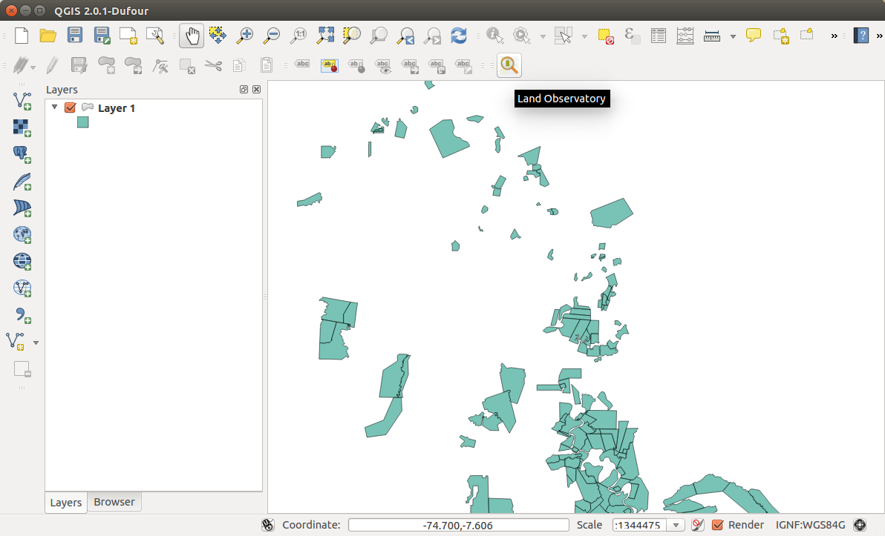
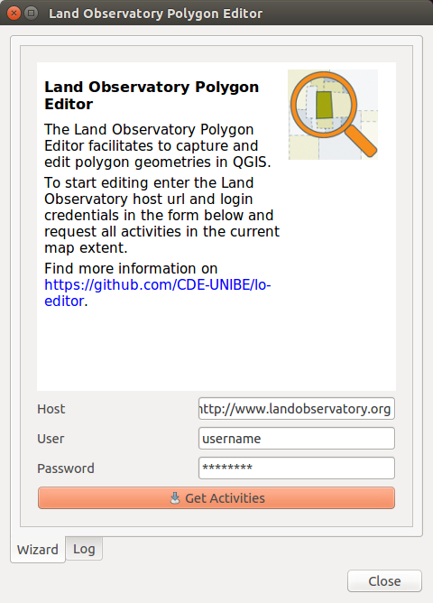

QGIS Plugin for Polygons
========================

To add or edit poygons for the Land Observatory, there is a plugin called
**Land Observatory Polygon Editor** which was written for the Open Source
Geographic Information System `QGIS`_.

.. _QGIS: http://www.qgis.org/

Installation
------------

QGIS 2.0 or newer
^^^^^^^^^^^^^^^^^

.. NOTE::
   The following instructions are written for QGIS 2.0. If you are using a
   different version of QGIS, these steps may vary a little.

* `Download QGIS`_, install it and launch *QGIS Desktop*.

* In the *Plugins* menu, select *Manage and Install Plugins...* to open the
Plugin Manager.

* In the Plugin Manager, select *Settings* on the left and *Add...* a new
Plugin repository.

* Enter a Name (eg. ``Land Observatory``) and the following URL:

    ``http://www.landobservatory.org/qgis2/plugins/plugins.xml``

  Make sure the repository is enabled.

  .. image:: _static/images/qgis_plugin_01.png

* After clicking *OK*, the Repository is added to your *Plugin repositories*.

* In the Plugin Manager, click *New* on the left and select the *Land
Observatory Editor 2*. Then click on *Install plugin*.

* You will see a mesage that the Plugin was installed successfully. You can
then close the Plugin Manager.

  .. image:: _static/images/qgis_plugin_02.png

.. _Download QGIS: http://www.qgis.org/en/site/forusers/download.html

Older QGIS versions
^^^^^^^^^^^^^^^^^^^

If you are using an older version of QGIS (older than 2.0), you can use the
plugin written for versions 1.X. To install it, follow the instructions above
but use the following repository URL:

``http://www.landobservatory.org/qgis/plugins/plugins.xml``

Usage
-----

.. IMPORTANT::
   You can only add new polygons to Activities which are already in the
   database. You will first have to create the Activity on the web platform
   before you can add Polygon data using the QGIS plugin.

If the plugin was installed correctly, you should see the icon of the Land
Observatory in the QGIS toolbar.

Click on this icon to open the Land Observatory Polygon Editor.

The plugin will load Activities within the currently visible map extent of
QGIS. It is therefore recommended to load a layer first before loading the
Activities. Also make sure that specify the correct Coordinate Reference
System (CSR): World Geodetic System 1984 (IGNF:WGS84G).

In the Land Observatory Polygon Editor, adjust the host address if necessary
and enter the username and password you also use to log in to the host (for
example http://www.landobservatory.org).

Then click *Get Activities* to get a list of all Activities. This will query
the Activities and add them as a new layer called *Land deals representation
points*.

.. WARNING::
   Do not close the window of the plugin before you are done editing the
   polygon!

Select a feature of the layer and ... ?
