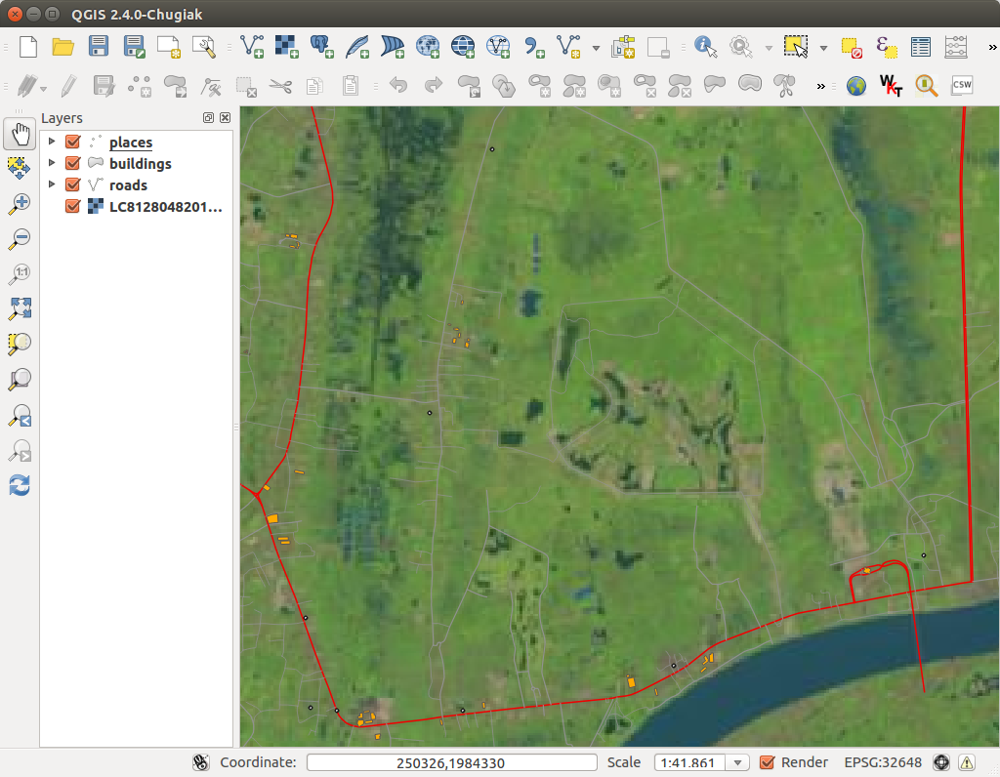
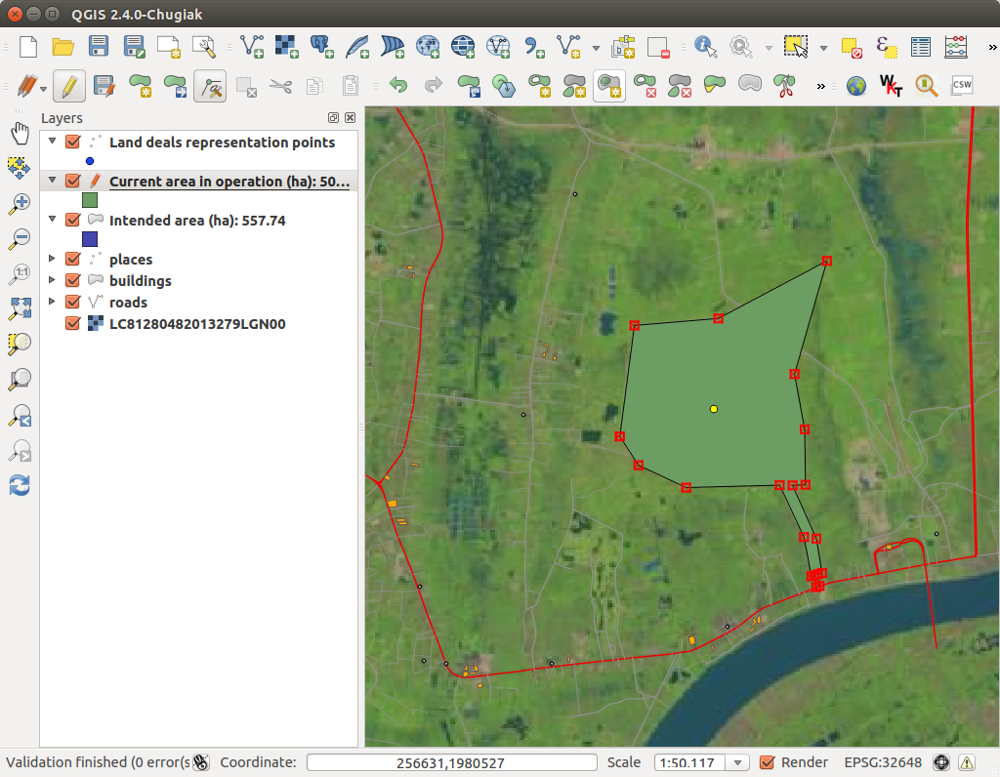

QGIS Plugin for Polygons
========================

To add or edit poygons for the Land Observatory, there is a plugin called
**Land Observatory Polygon Editor** which was written for the Open Source
Geographic Information System `QGIS`_.

.. _QGIS: http://www.qgis.org/

Installation
------------

QGIS 2.0 or newer
^^^^^^^^^^^^^^^^^

.. NOTE::
   The following instructions are written for QGIS 2.0. If you are using a
   different version of QGIS, these steps may vary a little.

* `Download QGIS`_, install it and launch *QGIS Desktop*.

* In the *Plugins* menu, select *Manage and Install Plugins...* to open the Plugin Manager.

* In the Plugin Manager, select *Settings* on the left and *Add...* a new Plugin repository.

* Enter a Name (eg. ``Land Observatory``) and the following URL:

    ``http://www.landobservatory.org/qgis2/plugins/plugins.xml``

  Make sure the repository is enabled.

  .. image:: _static/images/qgis_plugin_01.png

* After clicking *OK*, the Repository is added to your *Plugin repositories*.

* In the Plugin Manager, click *New* on the left and select the *Land Observatory Editor 2*. Then click on *Install plugin*.

* You will see a mesage that the Plugin was installed successfully. You can then close the Plugin Manager.

  .. image:: _static/images/qgis_plugin_02.png

.. _Download QGIS: http://www.qgis.org/en/site/forusers/download.html

If the plugin was installed correctly, you should see the icon of the Land
Observatory in the QGIS toolbar.

Older QGIS versions
^^^^^^^^^^^^^^^^^^^

If you are using an older version of QGIS (older than 2.0), you can use the
plugin written for versions 1.X. To install it, follow the instructions above
but use the following repository URL:

``http://www.landobservatory.org/qgis/plugins/plugins.xml``

Usage
-----

Before editing
^^^^^^^^^^^^^^

It is important to know, that you can add new polyons only to existing land deals.
In case you have a polygon geometry of a land deal, which is not yet in the database,
add first a new deal with all required base information to the `web platform`_.

Currently polygons are attached to the following area-aware attributes:

* "Intended area (ha)"
* "Contract area (ha)"
* "Current area in operation (ha)"

Open a web browser and make sure the deal which you want to edit has already the attribute where you want
to attach a new geometry or edit an existing one. If this is not the case you can calculate or estimate the
area in hectare and add this figure using the web based deal editor.

.. _web platform: http://www.landobservatory.org

Add or edit a new polygon
^^^^^^^^^^^^^^^^^^^^^^^^^

Start QGIS and prepare your data and data sources such as Shapefiles, scanned and referenced maps or
satellite images.

Click on the editor button |LO| located in the plugins toolbar to open the polygon editor.

.. |LO| image:: _static/images/lo-logo.png
         :width: 16px
         :height: 16px

The editor start window opens where you enter your login credentials. As host address use always http://www.landobservatory.org.
Now request all deals within the current map extent with *Get Activities*.

A new point layer named *Land deals representation points* is added to the map canvas. As the name suggests
it represents all existing land deals as points similar to the map view on the web platform.

In the next step select exactly one deal to edit using the usual QGIS selection tools.

Click *Start editing Activity* from the editor window.

All available information for the selected land deal is requested and loaded in the editor window.

Meanwhile a new polygon layer for each existing area-aware attribute is added to the map canvas.

Now edit or add new polygons using the usual QGIS editing tools. Use your additional datasources you prepared beforehand. Always properly finish
editing with *Toggle editing*.

.. NOTE::
   If you have already digitized geometries in a GIS layer you can copy and paste the geometry from one layer to another.

To upload your changes go back to the editor window and press *Submit Activity*.

.. WARNING::
   Do not close the editor window until you get a success message to make sure the upload was successful!

